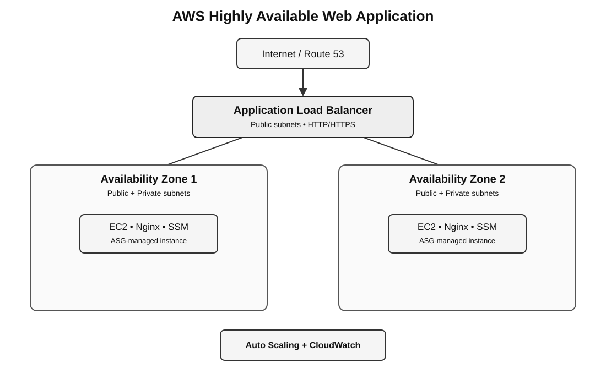

# AWS Highly Available Web Application

A highly available web application architecture built on AWS using Amazon VPC, EC2, Application Load Balancer, Auto Scaling, CloudWatch, and Route 53.

## Architecture



### Traffic flow

`Internet → Route 53 → ALB → Target Group → EC2 instances in private subnets`

EC2 instances are distributed across two Availability Zones and maintained by an Auto Scaling Group. The ALB is deployed in public subnets, while application servers remain private. Private instances use a NAT Gateway for outbound Internet access.

## AWS Services

- **Amazon VPC** — isolated network with public and private subnets
- **Internet Gateway** — Internet connectivity for public subnets
- **NAT Gateway** — outbound Internet access for private instances
- **Application Load Balancer** — distributes HTTP/HTTPS traffic across instances
- **Amazon EC2** — Nginx web servers in private subnets
- **Auto Scaling Group** — maintains desired capacity and replaces unhealthy instances
- **Amazon CloudWatch** — metrics, alarms, and scaling signals
- **AWS Systems Manager Session Manager** — administrative access without public SSH
- **Amazon Route 53** — DNS alias to the ALB (optional)
- **AWS Certificate Manager** — TLS certificate for HTTPS (optional)

## Network Design

| Layer | AZ-1 | AZ-2 |
|---|---|---|
| Public | `10.0.1.0/24` | `10.0.2.0/24` |
| Private | `10.0.11.0/24` | `10.0.12.0/24` |

Public subnets route `0.0.0.0/0` through the Internet Gateway. Private subnets route outbound Internet traffic through the NAT Gateway.

> Lab note: this implementation uses one NAT Gateway to control cost. A production design would normally use one NAT Gateway per AZ for stronger outbound resiliency.

## Security Design

- ALB security group allows HTTP/80 from the Internet and HTTPS/443 when TLS is enabled.
- EC2 security group allows HTTP/80 **only from the ALB security group**.
- No public SSH access is required.
- EC2 instances use an IAM role with `AmazonSSMManagedInstanceCore` for Session Manager.
- Application instances are placed in private subnets.

## Auto Scaling

The Auto Scaling Group is configured with:

- Minimum: **2**
- Desired: **2**
- Maximum: **4**
- Target tracking: approximately **50% average CPU utilization**
- ELB health checks enabled

## Application

Each EC2 instance runs Nginx through EC2 User Data. The page displays the instance hostname and Availability Zone so that load balancing and multi-AZ behavior can be demonstrated visually.

## High Availability Validation

The project should be validated with:

1. Two healthy targets behind the ALB.
2. Requests successfully served through the ALB.
3. Termination of one ASG-managed instance.
4. Automatic replacement of the failed instance.
5. Continued application availability during replacement.
6. Verification that replacement targets become healthy.
7. Controlled CPU load to demonstrate Auto Scaling.
8. CloudWatch monitoring of target health and CPU utilization.

Detailed procedures are in [`testing/high-availability-tests.md`](testing/high-availability-tests.md).

## Repository Structure

```text
architecture/       Architecture diagrams
app/                Example application page
bootstrap/          EC2 User Data
networking/         VPC, subnet, and routing documentation
load-balancer/      ALB and target group documentation
autoscaling/        Launch template, ASG, and scaling documentation
monitoring/         CloudWatch metrics and alarms
security/           Security groups and IAM
route53/            DNS configuration
testing/             HA and scaling tests
docs/               Deployment, troubleshooting, and cost notes
.github/workflows/  Documentation validation CI
```

## Cost Considerations

This project uses low-cost `t3.micro` instances for learning. The ALB, NAT Gateway, Route 53 hosted zone, data transfer, and other AWS resources can incur charges. Delete or stop lab resources when testing is complete.

## Limitations and Production Improvements

This is a portfolio/lab implementation, not a claim of full production readiness. Potential production improvements include:

- NAT Gateway per AZ
- HTTPS-only access with ACM and security headers
- AWS WAF in front of the ALB
- Centralized logging and longer retention
- VPC endpoints where appropriate
- Infrastructure as Code using Terraform or CloudFormation
- CI/CD deployment pipeline
- Application secrets in AWS Secrets Manager or Parameter Store
- More restrictive outbound security controls
- Database tier using Amazon RDS Multi-AZ if persistent data is required

## Deployment

See [`docs/deployment.md`](docs/deployment.md).
